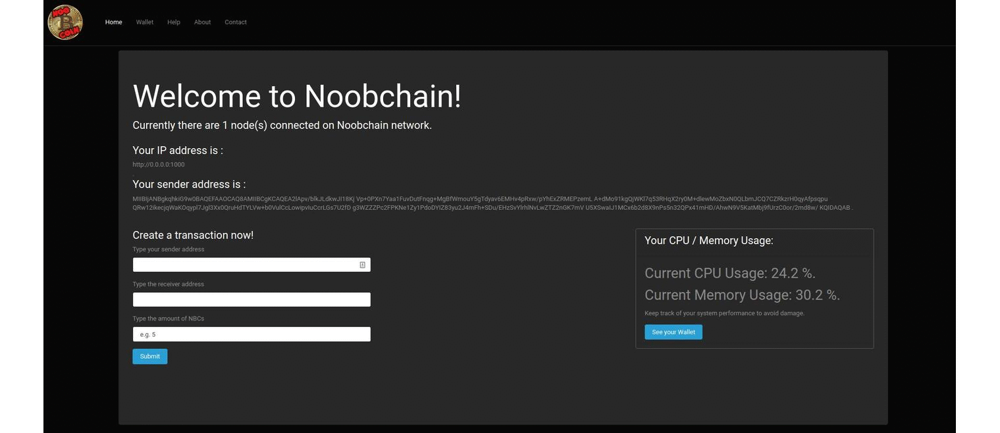

# Noobchain (Fullstack Flask App)

Blockchain Project for 'Distributed Systems' M.Sc. Course 2019-2020.

## Architecture
???????

<div style="display:block;margin:auto;height:80%;width:80%">
  
</div>

## REST API Implementation

##### Backend
| URL                        | Type | Action  |
|:--------------------------:|:----:|:-------:|
|/chain                      | GET  |Get the blockchain from other nodes to resolve conflict|
|/transactions/view 	     | GET 	|View transactions from last verified block|
|/transactions/create/browser| POST |Create a transaction via browser client|
|/transactions/money/sent 	 | GET 	|Get money sent from verified transactions|
|/transactions/money/received| GET |Get money received from verified transactions|
|/transactions/create        | POST |Create a transaction|
|/broadcast/transaction      | POST |Broadcast a transaction to other nodes|
|/broadcast/ring 	         | POST |Broadcast the node to other nodes (for Bootstrap node)|
|/broadcast/block            | POST |Broadcast a block to other nodes|
|/nodes/register             | POST |Register node to bootstrap ring|

##### Frontend
| URL      | Type| Action                     |
|:--------:|:---:|:--------------------------:|
| /        | GET | Home Page                  |
| /wallet  | GET | Node's wallet              |
| /help    | GET | User Manual                |
| /about   | GET | Application Information    |
| /contact | GET | Contact page               |

## Project Structure
```
~/noobchain
│
└── backend
   | block.py
   | blockchain.py
   | node.py
   | run_transactions.py
   | transaction.py
   | wallet.py
│
└── static
   | js
   | css
│
└── templates
   | layout
       | base.html
       | footer.html
       | navbar.html
   | about.html
   | contact.html
   | help.html
   | home.html
   | wallet.html
│
└── transactions
       | 5 nodes
       | 10 nodes
│
└── main.py
   | Feature Extraction
   | Clean Data
       | General
       | Geospatial Data

```

## Contributors


Nick Nikitas [(03400043)](https://github.com/nikoshet) - ΕΔΕΜΜ.

Dimitris Zografakis [(03400050)](https://github.com/dimzog) - ΕΔΕΜΜ.

Dimitris Lambrakis [()](https://github.com) - ΕΔΕΜΜ.


#### Setup 

```
pip install -r requirements.txt
```
##### Run Server
```
python3 main.py -ip IP -port PORT -bootstrap TRUE -ip_boostrap IP_OF_BOOTSTRAP -port_bootstrap PORT_OF_BOOTSTRAP -nodes NO_OF_NODES -cap CAPACITY -dif DIFFICULTY
```

### Specs

### Licence

css used is under the MIT License and can be found here: [darkly](https://bootswatch.com/darkly/)

Nick Nikitas, Dimitris Zografakis, Dimitris Lambrakis.

Copyright © 2020

