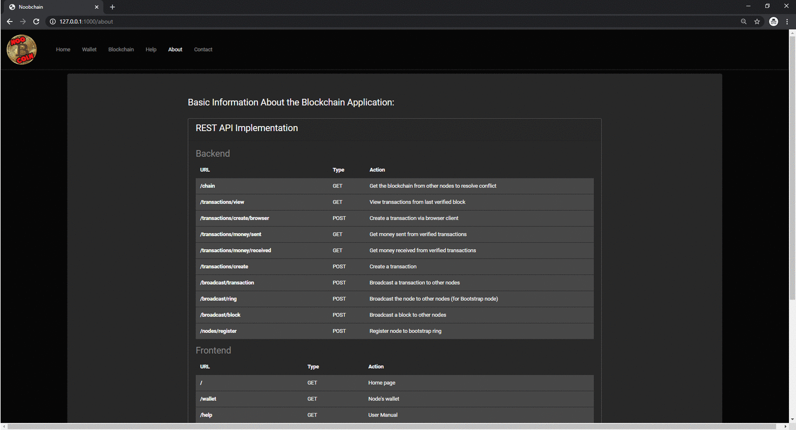

# Noobchain (Fullstack Flask App)

Blockchain Project for 'Distributed Systems' M.Sc. Course 2019-2020.


## REST API Implementation

##### Backend
| URL                        | Type | Action  |
|:--------------------------:|:----:|:-------:|
|/chain                      | GET  |Get the blockchain from other nodes to resolve conflict|
|/transactions/view 	     | GET 	|View transactions from last verified block|
|/transactions/create/browser| POST |Create a transaction via browser client|
|/transactions/money/sent 	 | GET 	|Get money sent from verified transactions|
|/transactions/money/received| GET |Get money received from verified transactions|
|/transactions/create        | POST |Create a transaction|
|/broadcast/transaction      | POST |Broadcast a transaction to other nodes|
|/broadcast/ring 	         | POST |Broadcast the node to other nodes (for Bootstrap node)|
|/broadcast/block            | POST |Broadcast a block to other nodes|
|/nodes/register             | POST |Register node to bootstrap ring|

##### Frontend
| URL      | Type| Action                     |
|:--------:|:---:|:--------------------------:|
| /        | GET | Home Page                  |
| /wallet  | GET | Node's wallet              |
| /help    | GET | User Manual                |
| /about   | GET | Application Information    |
| /contact | GET | Contact page               |
| /blockchain | GET | View Current Blockchain |

## Project Structure
```
~/noobchain
│
└── backend
|   | block.py
|   | blockchain.py
|   | node.py
|   | transaction.py
|   | wallet.py
│
└── public_keys
│
└── static
|   └─ js
|   └─ css
│
└── templates
│   └─ layout
│   │   │ base.html
│   │   │ footer.html
│   │   │ navbar.html
│   │ about.html
│   │ contact.html
│   │ help.html
│   │ home.html
│   │ wallet.html
│
└── transactions
│   └─ 3 nodes
│   └─ 5 nodes
│   └─ 10 nodes
│
│  main.py
```

## Web Interface

<div style="display:block;margin:auto;height:80%;width:80%">
  
</div>

## Setup 

```
pip install -r requirements.txt
```
#### Run Application
##### Parameters
| Parameter      | Info|
|:--------------:|:---:|
| -ip            | IP of node | 
| -p             | Port of node | 
| -bootstrap     | Boolean - if the node is bootstrap |
| -ip_bootstrap  | IP of bootstrap node | 
| -port_bootstrap| Port of bootstrap |
| -nodes         | number of nodes in network | 
| -cap           | capacity of each block in transactions | 
| -dif           | difficulty in mining of blocks | 
##### Run Example
```
python3 noobchain/main.py -ip 0.0.0.0 -p 1000 -bootstrap True -ip_bootstrap 0.0.0.0-port_bootstrap 1000 -nodes 5 -cap 4 -dif 4
```

## Contributors


Nick Nikitas [(03400043)](https://github.com/nikoshet) - ΕΔΕΜΜ.

Dimitris Zografakis [(03400050)](https://github.com/dimzog) - ΕΔΕΜΜ.

Dimitris Lamprakis [(03400059)](https://github.com/amra13579) - ΕΔΕΜΜ.

---
### Licence

The css code used is under the MIT License and can be found here: [darkly](https://bootswatch.com/darkly/).

The logo of the web interface is based on Bitcoin logo, and can be found [here](https://bitcoin.org/en/).

Nick Nikitas, Dimitris Zografakis, Dimitris Lamprakis.

Copyright © 2020

